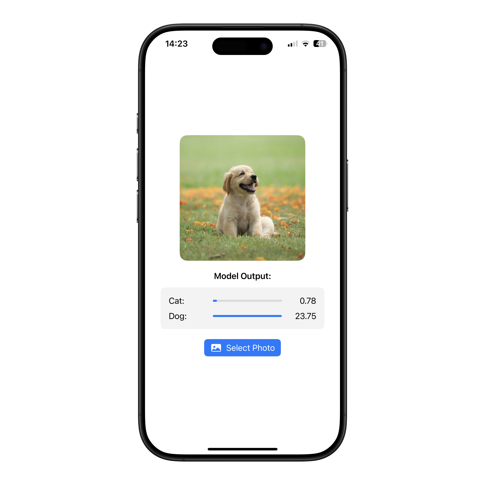

# Cat Dog Classifier

An iOS demo app that uses machine learning to classify images as either cats or dogs.

  

## Features

- Real-time image classification using CoreML
- Visual probability display for classification results

## Project Structure

- **CatDog**: iOS app written in Swift using SwiftUI and CoreML
- **model_convert**: Python utilities for converting PyTorch models to CoreML format using `coremltools`

## Model Conversion

If you want to convert your own PyTorch model:

1. Install dependencies: `uv sync`
2. Convert the model and test it with the provided notebook

## License

See the [LICENSE](LICENSE) file for details.